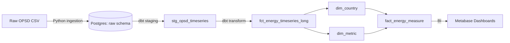

# ⚡ EU Energy Analytics Pipeline for Xebia
_A demo project to showcase my Analytics Engineering skills for the **Xebia** Analytics Engineer position._

---

## 🎯 Project Purpose  
This project demonstrates my ability to design, build, and document a **modern data pipeline** from raw open data to clean analytics dashboards.  
It’s a hands-on case study to highlight the skills I want to bring to **Xebia**:  

- 🛠️ **Engineering** → Python, Docker, dbt, Postgres, Metabase  
- 📊 **Analytics** → data modeling, testing, visualization  
- ☁️ **Cloud mindset** → reproducible infra, containerization  
- ✅ **Governance & quality** → dbt tests, lineage  
- 🚀 **Consulting value** → turning raw data into actionable insights  

---

## 🗺️ Data Flow Overview  



---

## 🏗️ Pipeline Architecture  

### 🔹 Ingestion (Python)  
- Download hourly European energy data from **OPSD**.  
- Store as raw CSV and load into **Postgres** (`raw.opsd_timeseries_raw`).  

### 🔹 Storage (Postgres in Docker)  
- Containerized Postgres DB for local dev.  
- Raw schema preserved for reproducibility.  

### 🔹 Transformation (dbt)  
- **Staging view** → clean, lowercase column names.  
- **Long fact table** → reshaped wide → long (utc_timestamp, metric, value, country).  
- **Dimensions** → `dim_country`, `dim_metric`.  
- **Fact table** → `fact_energy_measure` (joins facts with dimensions).  

### 🔹 Quality & Docs (dbt tests + docs)  
- ✅ Tests: not_null, unique, accepted_values.  
- 📖 dbt docs lineage graph to visualize data flow.  

### 🔹 Visualization (Metabase)  
- Line charts, area charts, KPI cards, and maps.  
- Interactive dashboard: *EU Energy Analytics*.  

---

## 📊 Example Dashboards  

### 🔸 Load Trends by Country  
Line chart of electricity demand (`load_actual`) for NL vs DE over time.  

### 🔸 Renewable vs Fossil Share  
Stacked area chart: solar, wind, hydro vs fossil, nuclear.  

### 🔸 Peak Demand KPI  
Single-number cards showing maximum load per country.  

---

## 🚀 How to Run  

### 1. Clone repo  
```bash
git clone https://github.com/shahsuvarli/xebia-eu-energy-project/.git
cd xebia-eu-energy-project
```

### 2. Start everything  
```bash
make start
```
This will:  
- 🐘 Start Postgres in Docker  
- 📊 Start Metabase (localhost:3000)  
- 🔧 Activate Python venv + env vars  
- 📖 Serve dbt docs (localhost:8080)  

### 3. Ingest data  
```bash
source .venv/bin/activate
export $(grep -v '^#' .env | xargs)
python src/ingestion/ingest_opsd_timeseries.py
```

### 4. Build models & tests  
```bash
make dbt-run
```

### 5. Open dashboards  
- Metabase: [http://localhost:3000](http://localhost:3000)  
- dbt docs: [http://localhost:8080](http://localhost:8080)  

---

## 🧰 Tools Used  
- 🐍 Python (pandas, SQLAlchemy)  
- 🐘 Postgres (Dockerized)  
- 📦 dbt (transformations, tests, lineage)  
- 📊 Metabase (BI dashboards)  
- 🐳 Docker (infra)  
- ⚙️ Makefile (automation)  

---

## ✨ Why This Project for Xebia?  

- ✅ **End-to-end pipeline**: from raw CSV to star schema & dashboards.  
- ✅ **Analytics Engineering mindset**: data modeling, testing, governance.  
- ✅ **Consulting flavor**: clear story, business-friendly outputs.  
- ✅ **Cloud-native thinking**: containerized, reproducible setup.  

This project is not just about data—it’s about **showing how I think like an Analytics Engineer at Xebia**: pragmatic, hands-on, quality-driven, and focused on delivering value fast.  

---

## 🙋 About Me  
I’m **Elvin Shahsuvarli**, an Analytics Engineer professional based in Budapest.  
- 📈 7+ years in data (analytics, governance, engineering).  
- 🏦 Experience at Morgan Stanley (data lineage, automation, GenAI for risk).  
- 💡 Passion for building scalable, reliable data systems that empower teams.  

👉 This project is my way of saying: I’m ready to bring my skills and energy to **Xebia Amsterdam** as your next **Analytics Engineer**.  

---

## 📬 Contact  
- 📧 [shahsuvarli.elvin@gmail.com](mailto:shahsuvarli.elvin@gmail.com)  
- 🔗 [LinkedIn](https://linkedin.com/in/shahsuvarli)  
- 💻 [GitHub](https://github.com/shahsuvarli)  
